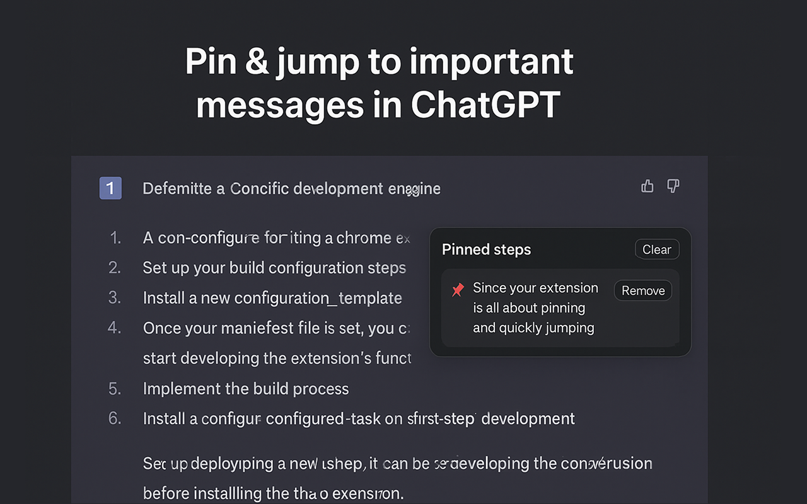

# AnchorGPT (ChatGPT Pins)



<a href="https://www.producthunt.com/products/anchorgpt?embed=true&utm_source=badge-featured&utm_medium=badge&utm_source=badge-anchorgpt" target="_blank"></a>

Pin important assistant messages in ChatGPT so you can jump back to them later. A lightweight Chrome extension built with React 18 and Manifest V3.

## Features

- Pin/unpin any assistant message in ChatGPT with a small 📌 button
- Quick-jump sidebar: hover the right edge to reveal your pinned steps
- Click a pin to scroll to and briefly highlight the original message
- Pins are stored per chat and synced via `chrome.storage.sync`
- Safe Shadow DOM UI, no CSS bleed; zero external network requests
- Built on React 18 + Webpack 5; Manifest V3 compatible

## How it works

- A content script injects a Shadow DOM app into ChatGPT pages and watches for new assistant messages.
- Each assistant message gets a 📌 button; clicking it toggles a pin `{ id, label, ts }`.
- Pins are saved under the current chat id (parsed from the URL) in `chrome.storage.sync`.
- A minimal sidebar appears when you move your mouse to the right edge; use it to navigate or clear pins for the current chat.

## Prerequisites

- Node.js >= 16
- Yarn or npm
- Google Chrome (or a Chromium-based browser that supports Manifest V3)

## Setup

```bash
git clone <your-repo-url>
cd chatgpt-pins
yarn   # or: npm install
```

## Build

Create a production build into `dist/`:

```bash
yarn build
```

## Development (watch rebuilds)

Rebuild on file changes into `dist/`:

```bash
yarn dev
```

Then keep `chrome://extensions` open and click Reload on the extension after changes. (Manifest V3 does not auto-reload content scripts.)

## Load in Chrome

1. Open `chrome://extensions`
2. Enable Developer mode (top-right)
3. Click “Load unpacked” and select the `dist/` folder
4. Open ChatGPT and you should see small 📌 buttons on assistant messages

## Usage

- Click the 📌 on any assistant message to pin/unpin it
- Hover the far right edge of the window to reveal the sidebar
- Click a pin to jump to the original message (it will briefly highlight)
- Use the “Clear” button in the sidebar to remove all pins for the current chat

## Scripts

- `yarn dev` – watch and rebuild into `dist/`
- `yarn build` – production build into `dist/`
- `yarn zip` – package the current `dist/` as `extension.zip`

## Permissions & Privacy

- Permissions: `storage` only
- Data: Pins are stored in `chrome.storage.sync` under a single key; no external requests; no analytics

## Compatibility

- Chrome (MV3). Likely compatible with Edge/Brave/Arc. Firefox is not supported (MV3 differences).

## Project structure

```
chatgpt-pins/
├─ public/
│  └─ manifest.json           # MV3 manifest (name: AnchorGPT)
├─ src/
│  ├─ content.jsx             # Injects the app into ChatGPT pages
│  ├─ background.jsx          # Service worker (MV3)
│  ├─ popup.{html,jsx}        # Browser action popup
│  ├─ ui/                     # Shadow DOM UI (Sidebar, Pins, etc.)
│  └─ lib/                    # DOM helpers, observer, storage, router, styles
├─ webpack*.js                # Webpack base/dev/prod configs
└─ dist/                      # Build output (load this in Chrome)
```

## Tech stack

- React 18, React DOM 18
- Webpack 5, Babel
- Manifest V3

## License

ISC
